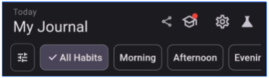
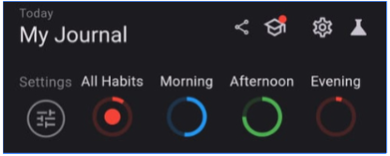
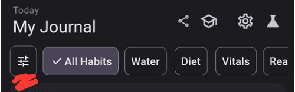
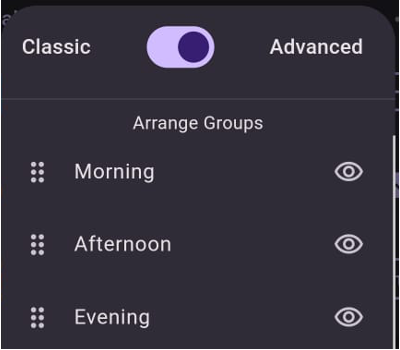

# Advance Filter

Transform your classic filter to advanced filter.

Classic Filter

👇👇👇👇👇👇👇👇👇👇👇

Advanced Filter

### What is advanced filter?
Advanced filter lets you monitor day's habit group progress along with filtering feature.

Red- Low;
Blue- Medium;
Green- Strong

### How to enable advanced filter?
1. Tap on first icon on the filter bar.
   
2. Flip toggle to advanced filter on the filter options dialog.
   