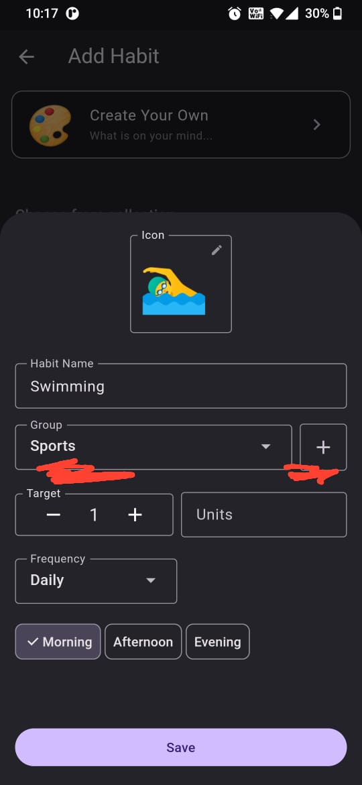

# Multiple Groups

Life has many aspects. Be it mind, body, relationships, soul. 
HabitPlus allows you to group habits into multiple areas. And let you track them in one single place.

### How to create a group?

While creating an habit. Save habit with a new group name. That's it.

Give it a try.