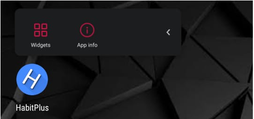
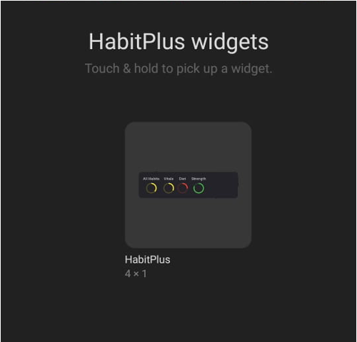

# HomeScreen Widget

Progress Widget lets you monitor day's progress for different Habit Groups. It is very effective to keep you on track. 

Steps:
1. Long Press on the app launcher icon.

2. Select "Widgets" option.
3. Drag widget to your "HomeScreen".

4. Resize the widget to full width.

Cheers!

Happy Growing!