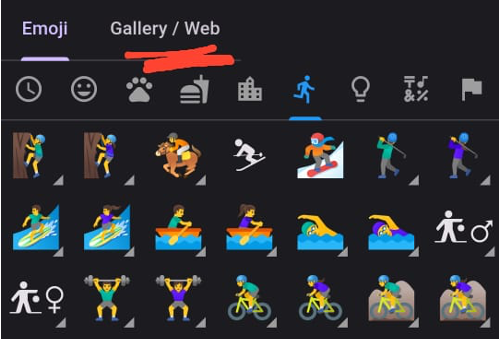

# Custom Icons

HabitPlus allows you to upload icons from your gallery.

### To Upload Custom Icon:

1. Select "Web/Gallery" tab next to "Emoji" tab when selecting icon.   

2. Search & download icon from web.
3. Upload icon from gallery.