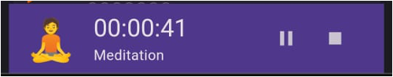

# Timer

Use in-app timer to log your time bound habits.



### How to start a timer:
1. Create a habit which have "units" tracked in time. 
2. Allowed values for units: 
   ```
   ["minute", "minutes", "mins","min",
    "hours", "hour", "hrs", "hr",
    "seconds", "second", "secs", "sec"]
3. Once habit is created, long press on the habit and select - Start Timer.


Cheers :)